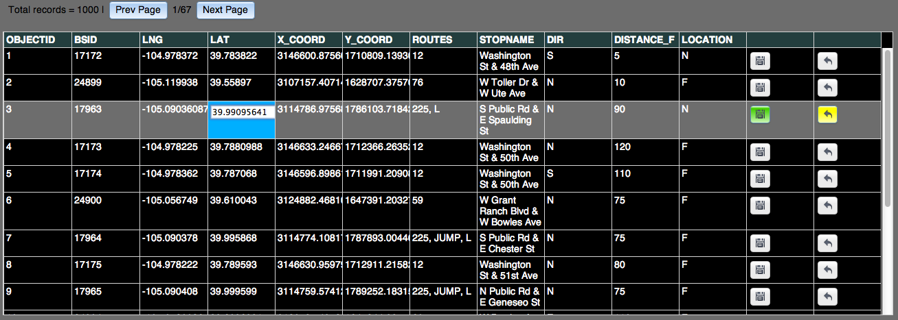
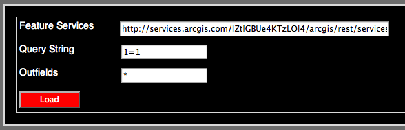
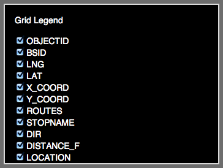

#feature-service-editor

This ready-to-go JavaScript prototype provides very basic SQL-like capabilities for browsing, modifying and deleting data in "point" based feature services with or without a map. It is intended for reading any valid ArcGIS FeatureService. 

Use this application as-is, embed it in your own application, extend or modify it to meet your needs. Basically have fun, and feedback or contributions are appreciated!

## Instructions (Four easy steps)

1. Copy-and-paste a FeatureService endpoint into the field labeled "Feature Service". 
	* **IMPORTANT**: The FeatureService must have an <code>OBJECTID</code> field.
2. Click the "Load" button.
3. Double click on any field to enable the edit mode. Edit the field. For that row the Save, Undo and Delete buttons should become visible and enabled.
4. When you are done editing select "Save", "Undo" or "Delete".

## To add a new row of data
Allows for the ability to add one new row of data at a time.

1. After loading a feature service, select the "Add Record" button. This creates a new grid that you can use to enter the data. It should be highlighted with yellow cells.
2. Enter your changes in the new grid.
3. When you are done adding data select "Save" or "Undo". 
4. Or, if you want to delete your changes without saving them select the "Remove New Record" button. 

## Using Query String

Query String lets you set the SQL string for returning data. When left blank it will return all data. As an example, to data for record 115 would be to specify: objectId='115'.

## To hook your map to grid events

1. Add your map code into the appropriate listener in the <code>controller.utils._setListeners </code> function.

## Main Editor Window

## Add Record Window

![] (screenshot4.png)

## Control Panel

## Grid Legend Control Panel

## Requirements

* **IMPORTANT:** Requires a valid ArcGIS Feature Service that contains an <code>OBJECTID</code> field.
* **IMPORTANT:** Always secure your services when allowing editing! For more information on securing your services go [here](https://developers.arcgis.com/en/authentication/user-logins.html).
* Experience with JavaScript and some experience with the [ArcGIS API for JavaScript](https://developers.arcgis.com/en/javascript/).
* Tested to work on Desktop versions of Chrome 26 & 27, Firefox 21, Internet Explorer 9. The current version has not been architected to work on a mobile device.

## Resources

* [ArcGIS API for JavaScript Resource Center](https://developers.arcgis.com/en/javascript/)
* [ArcGIS Blog](http://blogs.esri.com/esri/arcgis/)
* [twitter@esri](http://twitter.com/esri)

## Issues

Find a bug or want to request a new feature?  Please use the [submit new Issue](https://github.com/Esri/feature-service-editor-js/issues/new) feature on this repo.

## Contributing

Anyone and everyone is welcome to contribute. 

## Licensing
Copyright 2013 Esri

Licensed under the Apache License, Version 2.0 (the "License");
you may not use this file except in compliance with the License.
You may obtain a copy of the License at

[http://www.apache.org/licenses/LICENSE-2.0](http://www.apache.org/licenses/LICENSE-2.0)

Unless required by applicable law or agreed to in writing, software
distributed under the License is distributed on an "AS IS" BASIS,
WITHOUT WARRANTIES OR CONDITIONS OF ANY KIND, either express or implied.
See the License for the specific language governing permissions and
limitations under the License.

A copy of the license is available in the repository's [license.txt]( https://raw.github.com/andygup/feature-service-editor/master/license.txt) file.

