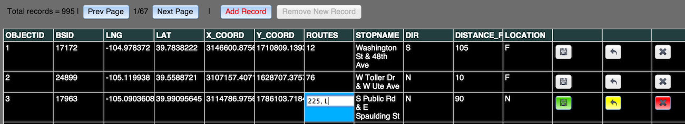

#feature-service-editor

This ready-to-go JavaScript prototype provides very basic SQL-like capabilities for browsing and editing a feature service with or without a map. It is intended for reading any valid ArcGIS FeatureService. 

In the current version you can edit one field at a time, it does not include batch update capabilities (yet). 

Use this application as-is, embed it in your own application, extend or modify it to meet your needs. Basically have fun, and feedback is appreciated!

## Instructions (Five easy steps)

1. Copy-and-paste a FeatureService endpoint into the field labeled "Feature Service". 
	* **IMPORTANT**: The FeatureService must have an <code>OBJECTID</code> field.
2. Assign a Query String. <code>"1=1"</code> is the equivalent of <code>"*"</code> to retrieve all records.
3. Click the "Load" button.
4. Double click on any field to enable the edit mode. Edit the field. For that row the Save and Undo buttons should become visible and enabled.
5. Select "Save" or "Undo".

## To hook your map to grid events

1. Add your map code into the appropriate listener in the <code>controller.utils._setListeners </code> function.

## Main Editor Window

## Control Panel

## Grid Legend Control Panel

## Requirements

* **IMPORTANT:** Requires a valid ArcGIS Feature Service that contains an <code>OBJECTID</code> field.
* **IMPORTANT:** Always secure your services when allowing editing! For more information on securing your services go [here](https://developers.arcgis.com/en/authentication/user-logins.html).
* Experience with JavaScript and some experience with the [ArcGIS API for JavaScript](https://developers.arcgis.com/en/javascript/).
* Tested to work on Desktop versions of Chrome 26 & 27, Firefox 21, Internet Explorer 9. The current version has not been architected to work on a mobile device.

## Resources

* [ArcGIS API for JavaScript Resource Center](https://developers.arcgis.com/en/javascript/)
* [ArcGIS Blog](http://blogs.esri.com/esri/arcgis/)
* [twitter@esri](http://twitter.com/esri)

## Issues

Find a bug or want to request a new feature?  Please let us know by submitting an Issue on this repo.

## Contributing

Anyone and everyone is welcome to contribute. 

## Licensing
Copyright 2013 Esri

Licensed under the Apache License, Version 2.0 (the "License");
you may not use this file except in compliance with the License.
You may obtain a copy of the License at

[http://www.apache.org/licenses/LICENSE-2.0](http://www.apache.org/licenses/LICENSE-2.0)

Unless required by applicable law or agreed to in writing, software
distributed under the License is distributed on an "AS IS" BASIS,
WITHOUT WARRANTIES OR CONDITIONS OF ANY KIND, either express or implied.
See the License for the specific language governing permissions and
limitations under the License.

A copy of the license is available in the repository's [license.txt]( https://raw.github.com/andygup/feature-service-editor/master/license.txt) file.

